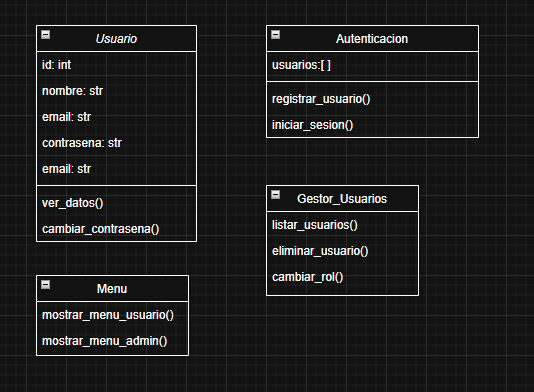

404NOTFOUNDERS

## NOMBRE DEL PROYECTO

Desarrollo de un sistema de autenticación y administración de usuarios basado en roles: implementación en entorno de consola con base de datos local

## TEMATICA 

Gestión y administración de usuarios con control de acceso por roles mediante una interfaz de consola.

## FUNDAMENTACION 

Elegimos abordar la problemática de la gestión de usuarios con control de acceso porque representa una necesidad común en numerosos sistemas informáticos, especialmente en instituciones educativas, organizaciones y pequeñas empresas que requieren diferenciar permisos y roles de forma segura y eficiente. Esta temática tiene un gran potencial, ya que sienta las bases para sistemas más complejos y seguros, permitiendo escalar funcionalidades en futuros desarrollos. Es altamente relevante para nuestro perfil profesional en programación y bases de datos, ya que integra conocimientos de lógica, diseño de bases de datos, programación orientada a objetos y buenas prácticas de desarrollo. Además, impacta positivamente en la sociedad al fomentar el desarrollo de soluciones tecnológicas accesibles y adaptables a distintos contextos.

## OBJETIVO

Desarrollar un programa de consola con un menú interactivo que facilite la
administración de usuarios según sus roles, diferenciando entre administradores y
usuarios estándar. Este sistema permitirá la gestión integral de registro de usuarios
e inicio de sesión, asegurando un control de acceso adecuado y una experiencia
intuitiva para los usuarios.
Además, se deberá diseñar una base de datos que permita la creación,
almacenamiento y manipulación eficiente de los datos de los usuarios, garantizando
su correcta gestión.

## TAREAS

El desarrollo del proyecto fue llevado a cabo de manera colaborativa entre todos los integrantes del grupo: Joaquín, Gabriel, Diego y Luis. Desde el inicio, trabajamos en conjunto en la planificación y distribución de tareas.

Si bien cada uno fue tomando pequeñas responsabilidades específicas en distintos momentos, el enfoque principal fue el trabajo en equipo. Nos ayudamos mutuamente con la lógica del código, la resolución de errores y la implementación de las funcionalidades. 

## DIAGRAMA DE CLASES

